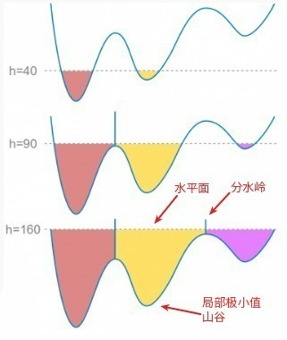
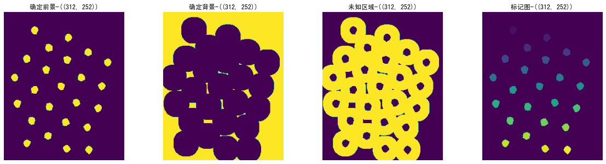
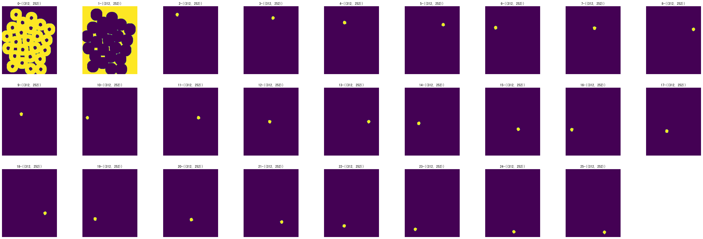
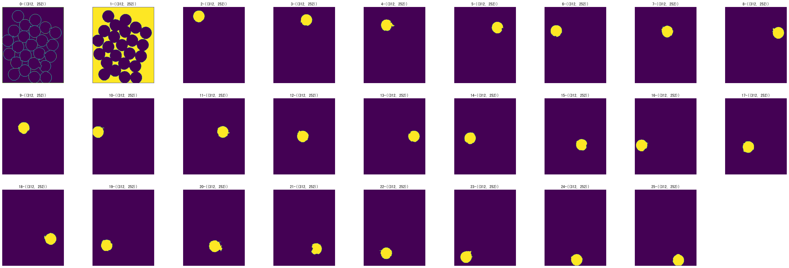

本项目主要是了解分水岭算法的原理，并根据使用场景将其封装为固定函数，然后配合生成json的函数，可以快速通过分水岭生成目标的json标注

分水岭算法原理



- 任何一副灰度图都可以看作是拓扑平面，灰度值高的区域被看成山峰，灰度值低的区域看作山谷
- 向每个山谷灌不同颜色的水，随着水位的升高，不同山谷的水就会相遇，为了防止不同山谷的水汇合，在水汇合的地方构筑堤坝
- 不停地灌水，不停地构筑堤坝，直至所有山峰被水淹没，我们构筑的堤坝就是对图像的分割

opencv分水岭算法接口介绍

`void cv: : watershed (InputArray image, InputOutputArray markers)`



函数输入：接口要求输入原图image、标记图markers，其中标记图包含“确定前景、确定背景、不确定区域”，分水岭的目地使用往“确定前景、确定背景”灌水，确定不确定区域的属于前景还是背景，上图分别展示“确定前景、确定背景、不确定区域”和包含这3个区域的标记图。



如何制作markers图？上图是制作的markers，值范围为0-25，其中0表示不确定区域，1表示确定背景，2-N表示确定性前景



函数返回：上图是接口返回值，和类似markers，值范围是-1和[1-25]，其中0代表的未知区域被1和2-N区域浸没

封装函数介绍
```python
watershedbydistant(image,markers=None)
```

直接输入原图+标记图即可，如果不存在标记图，该函数按照自己的方式构造标记图
